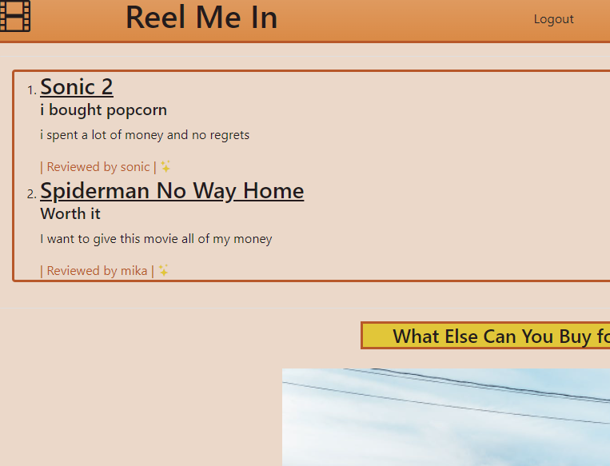

# Reel-Me-In

## Table of Contents

1. [What is app for?](#what)

1. [How to use the app](#how)

1. [How to report issues](#issues)

1. [How to make contributions](#contribute)

1. [Link to Deployed Application](#link)

### What is App for? <a name="what"></a>
Reel-Me-In was developed to allow the user to post comments about movies and decide if the movie was worth paying $9.50 a ticket to see in cinemas. It was created using:
* node.js
* express
* mysql2
* sequelize
* handlebars js
* bootstrap


### How to Use the App: <a name="how"></a>

```bash
git init
npm install bcrypt
npm install jest --save-dev
npm install express sequelize mysql2
npm install dotenv --save
npm install express-handlebars
npm install express-session
npm i express-session connect-session-sequelize
```

### How to Report Issues: <a name="issues"></a>
Contact any of the authors:
|Name   | Github    |
| ----- | -------   |
|Sergieo | SergieoL |
|Jaime  |  Deadpool3413 |
|Ted | The-Coding-Bat |
|Markeice | Markeicegreen16 |
|Mika | Mikak02 |
|Kailey | Kailey09 |

### How to Make Contributions <a name="contribute"></a>
Please contact authors for collaboration

### Link <a name="link"></a>
[Link to deployed Application](https://dashboard.heroku.com/apps/reel-me-in-2020)


